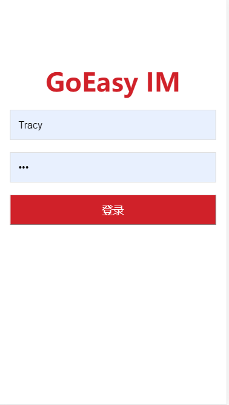

# GoEasyDemo-Vue-IM


##运行步骤

### 获取GoEasy Appkey
```
先注册一个账号，登录后，创建一个应用，就能得到您的appkey。
```
### 配置您的appkey
```
在 main.js，将appkey替换为您自己的common key
```

## 项目构建
```
npm install
```

### 运行

```
npm run serve
```

### 体验
1. 要发送语音、视频和图片，请先[配置阿里云OSS参数](https://www.goeasy.io/cn/im/media/alioss.html)
2. 在restapi.js 里 可以找到用户名和密码
3. 系统默认不启用用户上下线提醒服务，付费应用可以登陆GoEasy，在“我的应用”里启用


