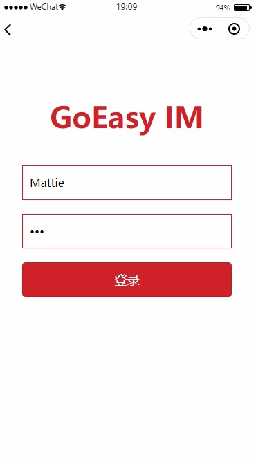

# 微信小程序快速实现IM聊天，支持私聊，群聊               

## 运行步骤
*  添加微信合法域名     
  https://mp.weixin.qq.com，进入微信公众平台|小程序 -> 设置 -> 开发设置 ->服务器域名   
   socket合法域名-> 添加GoEasy的地址： wss://wx-hangzhou.goeasy.io（记得wx-开头）
* 要发送语音、视频和图片，请先[配置阿里云OSS参数](https://www.goeasy.io/cn/im/media/alioss.html)
* 在app.js里将appkey替换为您自己的common key
* 在restapi.js 里 可以找到用户名和密码 
* 系统默认不启用用户上下线提醒服务，付费应用可以登陆GoEasy，在“我的应用”里启用

